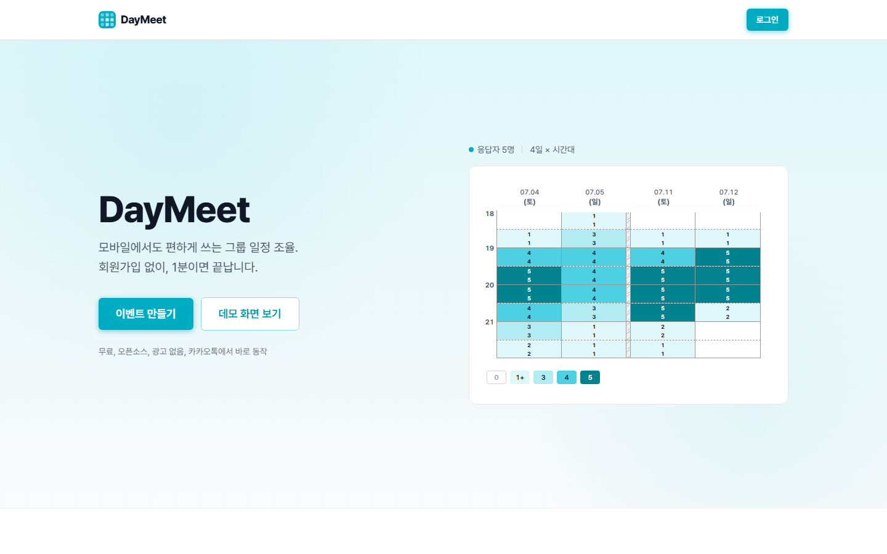
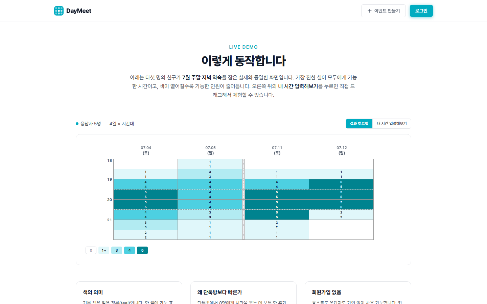
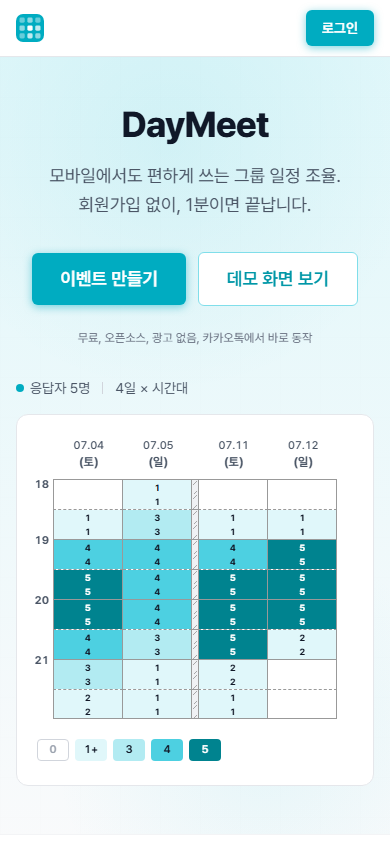

<div align="center">
  

# DayMeet

**회원가입 없이, 링크 하나로 끝내는 그룹 일정 조율**

[](LICENSE)
[](https://nextjs.org)
[](https://daymeet.org)

[**라이브 사이트**](https://daymeet.org) · [데모](https://daymeet.org/demo) · [사용 가이드](https://daymeet.org/guide) · [기여하기](CONTRIBUTING.md)

</div>

<br />

<div align="center">
  
</div>

<br />

## DayMeet이 뭔가요?

[when2meet](https://when2meet.com)의 한국어·모바일 친화 대안입니다.

호스트가 후보 날짜와 시간대를 정해 **링크 하나**를 공유하면, 참여자는 회원가입 없이 들어와 가능한 시간을 드래그로 표시합니다. 결과는 실시간 히트맵으로 모입니다 — 가장 진한 칸이 모두에게 가능한 시간.

단톡방에서 "언제 시간 돼?"로 한 주를 날리는 대신, 호스트는 1분, 참여자는 30초면 끝납니다.

## 주요 기능

- **링크 공유 참여** — 회원가입 없이 이름만 입력하고 바로 응답
- **모바일 드래그 입력** — 터치로 가능한 시간을 칠하듯 선택 (15분 단위)
- **두 가지 응답 모드** — 되는 시간 모으기 / 안 되는 시간 모으기
- **캘린더 + 요일 모드** — 특정 날짜 또는 매주 반복 요일로 조율
- **결과 히트맵** — 색 농도 + 셀별 가능 인원수로 한눈에 비교
- **Google 캘린더 연동** — 기존 일정을 불러와 자동 반영
- **비밀번호 보호** — 응답을 본인만 수정하도록 잠금 (선택)

## 화면

<table>
<tr>
<td width="62%"></td>
<td width="38%"></td>
</tr>
<tr>
<td align="center"><sub>데스크탑 — 결과 히트맵</sub></td>
<td align="center"><sub>모바일</sub></td>
</tr>
</table>

## 기술 스택

- **Next.js 16** (App Router) · **React 19** · **TypeScript 5**
- **Tailwind CSS 4** · **Framer Motion**
- **Supabase** — Postgres · Auth · Realtime · Row Level Security
- **Zod** — 입력 검증
- **Vitest** — 테스트
- 호스팅: **Vercel**

## 아키텍처

DayMeet 의 백엔드는 다섯 개의 레이어로 분리되어 있고, 의존성은 한
방향으로만 흐릅니다. 자세한 다이어그램과 디렉터리 구조는
[`docs/ARCHITECTURE.md`](docs/ARCHITECTURE.md) 를 참고하세요.

```text
UI → Client API → Controller(route.ts) → Service → Repository → Supabase
```

- **Controller (`src/app/api/**/route.ts`)** — `withApiHandler()` 미들웨어로
  zod 검증·예외 매핑·envelope 직렬화를 한 곳에서 처리합니다.
- **Service (`src/server/services/`)** — 도메인 로직과 권한 체크. HTTP 비의존.
- **Repository (`src/server/repositories/`)** — Supabase 쿼리 캡슐화.
- **Validators (`src/server/validators/`)** — 도메인별 zod 스키마.
- **Client API Layer (`src/lib/api-client/`)** — 타입 안전 fetch 래퍼.
  `ApiResponse<T>` envelope 을 자동으로 벗기고 실패 시 `ApiClientError` 를
  throw 합니다.

모든 API 응답은 다음 envelope 을 따릅니다.

```ts
type ApiResponse<T> =
  | { success: true; data: T }
  | { success: false; error: { code; message; details? } };
```

도메인 예외는 `src/server/http/errors.ts` 에 정의되어 있고, HTTP status 와
`code` 로 자동 매핑됩니다 (`NotFoundError` → 404 + `NOT_FOUND` 등).

## 평가 항목 매핑

학교 과제(AD 프로젝트, 자율주제) 평가 항목 5 개와 본 프로젝트의 구현
지점을 매핑한 표입니다.

| 평가 항목 | 본 프로젝트의 구현 |
| --- | --- |
| 1. 기능 완성도 | 라이브 사이트 [daymeet.org](https://daymeet.org), 13 개 REST API, 8 가지 그리드 모드 조합 |
| 2. 주제 독창성·기획력 | when2meet 한국어·모바일 친화 대안, 캘린더+요일 모드 동시 지원, 폴더/순서 관리, 실시간 히트맵 |
| 3. 기술 활용 적절성 | Supabase Auth (OAuth + RLS), 이벤트 비밀번호 HMAC 쿠키, zod 검증, 통일 예외/응답 envelope, withApiHandler 미들웨어 |
| 4. UI/UX | 모바일 드래그 입력, 자체 스크롤바, 자동 픽셀 정렬 그리드, 한국어 라벨, 반응형 |
| 5. 코드 구조·아키텍처 | 5-Layer Architecture (Controller→Service→Repository→DB) + 도메인별 Validator + Client API Layer. 단방향 의존성. 자세한 내용은 `docs/ARCHITECTURE.md` |

## 로컬 실행

```bash
npm install
npm run dev        # http://localhost:3000
```

환경 변수는 `.env.example`을 `.env`로 복사해 채웁니다 (Supabase URL/Key, Google OAuth 등).

## 기여

개발 프로세스, 브랜치 규칙, 프로젝트 구조는 [CONTRIBUTING.md](CONTRIBUTING.md)를 참고하세요.

## 라이선스

[MIT](LICENSE) · 오픈소스

<div align="center">
<br />
<strong>마음에 드시나요?</strong> <a href="https://github.com/BORB-CHOI/whenmeets">GitHub에서 Star 눌러주세요</a> ⭐
</div>
